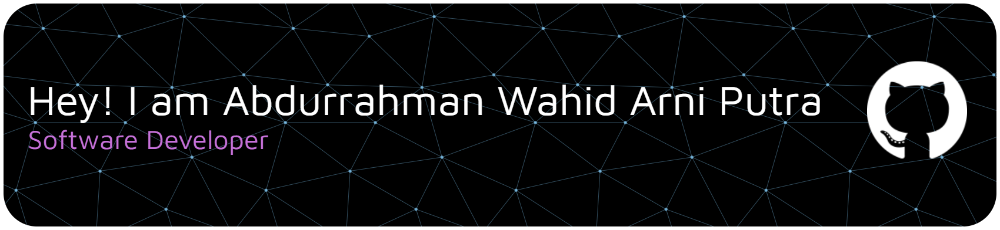

<h1 align="left">💫 About Me:</h1>

###

A passionate software explorer currently focusing on **Backend Development**. I enjoy building web applications and exploring how complex systems work under the hood.

### 🚀 Quick Overview
- 🔭 I’m currently strengthening my expertise in **Java & Spring Boot**.
- ⚡ I have experience building projects with **Laravel**, **Spring Boot**, and **Postman** for API testing.
- 🎨 I also dabble in Frontend using **React** and **Vue** (Basic) to create functional interfaces.
- 🛠️ I use **Git** for version control and **Figma** for design prototyping.

###

## 💻 Tech Stack:
     
     
###

## 🌐 Socials:

 

<picture>
  <source media="(prefers-color-scheme: dark)" srcset="https://raw.githubusercontent.com/abdurrahmanWAP/abdurrahmanWAP/output/pacman-contribution-graph-dark.svg">
  <source media="(prefers-color-scheme: light)" srcset="https://raw.githubusercontent.com/abdurrahmanWAP/abdurrahmanWAP/output/pacman-contribution-graph.svg">
  
</picture>

###
